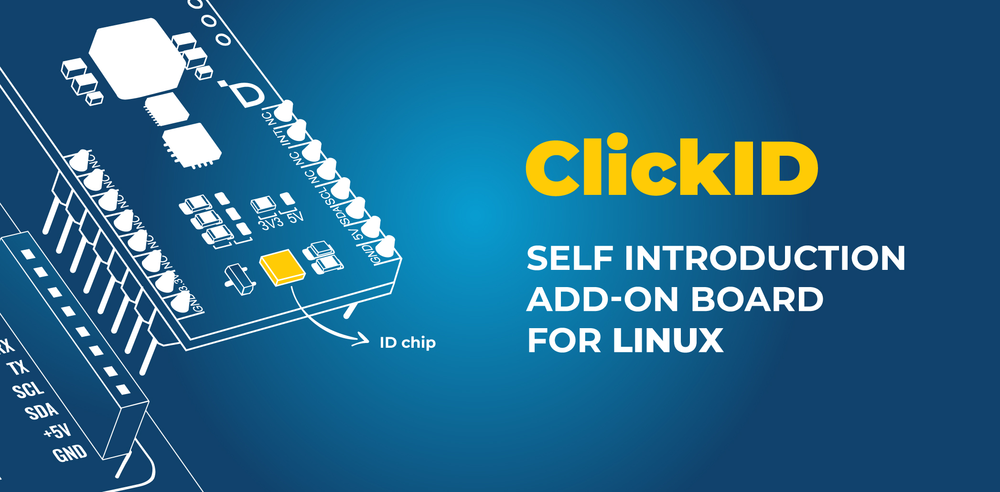
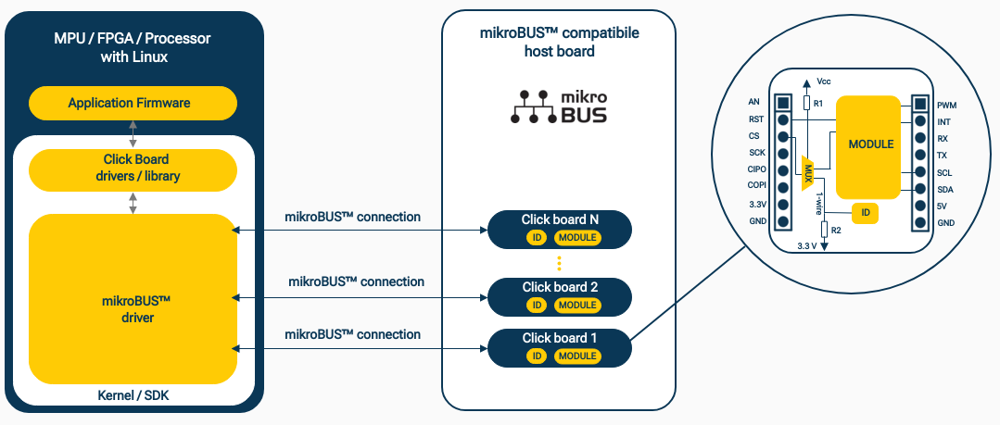
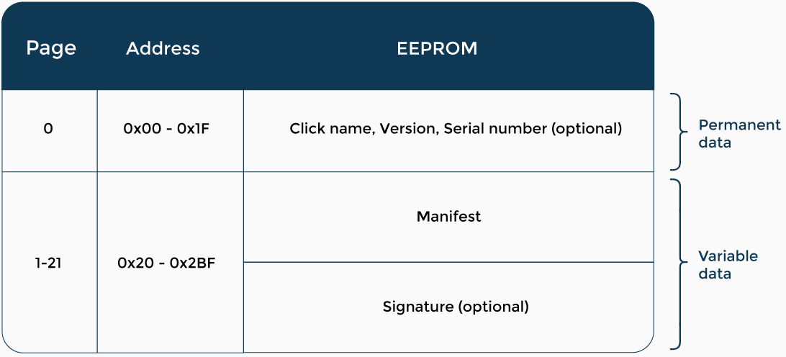
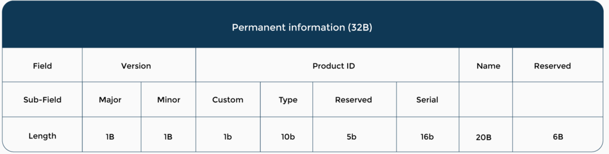

# ClickID - the self introducing add-on board



## **What is it?**

ClickID is a unique way for embedded board personalization by dedicating a device ID to each of them. Simplified communication through the 1-Wire protocol applicable to any board type using a secure authenticator device.

## **What will you get?**

Building blocks for the self-identifying and configurable embedded system, capable of knowing its peripherals like the PC systems.

## **The GOAL**

To make the configuration of the tools faster using a hot-plug system like in the PC world and to add traceability and authenticity to the embedded devices.

<div style="page-break-after: always;"></div>

## **The story behind - identifying a problem**

One of the long-time problems in embedded Linux and all similar OS is the non-existing standard for hot plugging add-on boards. Adding add-on boards into an embedded Linux system typically involves the following steps:
1. Identify the type of add-on board you have and the interface it uses to connect to the embedded Linux system. Common interfaces include SPI, I2C, UART, USB, and Ethernet.
2. Ensure that the kernel module for the add-on board is installed and loaded on the embedded Linux system. If the module is not installed, you may need to cross-compile it from the source code and install it manually.
3. Configure the interface used by the add-on board, such as SPI or I2C, on the embedded Linux system. This involves specifying the bus and device addresses that the add-on board uses.
4. Test the add-on board by writing a simple application that interacts with the board using the appropriate interface. 
5. If necessary, modify the device tree for the embedded Linux system to ensure the add-on board is correctly recognized and configured at boot time.

As you can see, adding add-on boards to an embedded Linux system can be a complex process that requires careful attention to detail and a good understanding of the hardware and software involved. Multiplying 1,000 boards by the number of 1000 host boards by the number of sockets supported on each of those boards ends up being a LOT of device tree overlay fragments. Further, applying those fragments is error-prone and can even prevent a system from booting.


# [Click Boards™](https://www.mikroe.com/click-boards) in Embedded Linux

ClickID is a hardware & software solution based on a secure authenticator device that enables the hot-plugging of [Click Boards™](https://www.mikroe.com/click-boards) or any other [mikroBUS™](https://download.mikroe.com/documents/standards/mikrobus/mikrobus-standard-specification-v200.pdf) compatible add-ons to embedded Linux. ClickID communicates with the operating system kernel via the 1-Wire protocol, authorizing any sensor on the add-on board to be automatically recognized. ClickID will deliver the manifest file to the operating system, and the proper driver loads to use the following interfaces (SPI, I2C, UART, PWM, ADC, reset, interrupt) for communication with the target device located on the add-on board.

## **How does it work?**

[Click board™](https://www.mikroe.com/click-boards) with **ID** functionality can operate in two modes:
- **REGULAR MODE**
    - Works as a [Click Board™](https://www.mikroe.com/click-boards) without **ID** functionality. This is a default mode. 
- **ID MODE**
    - It works as a unique device capable of introducing itself to the Linux kernel to load the driver automatically.

    - To switch a [Click Board™](https://www.mikroe.com/click-boards) in the **ID MODE**, the host board must hold the reset line to the '0' logic state. This way, the CS line is connected to EEPROM memory on the [Click Board™](https://www.mikroe.com/click-boards) through a multiplexer. To handle the  [mikroBUS™](https://download.mikroe.com/documents/standards/mikrobus/mikrobus-standard-specification-v200.pdf) socket and read the corresponding ID, we use the CS line, because only one host line must be unique for each  [mikroBUS™](https://download.mikroe.com/documents/standards/mikrobus/mikrobus-standard-specification-v200.pdf). This way, the host can uniquely identify each  [mikroBUS™](https://download.mikroe.com/documents/standards/mikrobus/mikrobus-standard-specification-v200.pdf) socket on the host board and read the **ID** from the corresponding [Click Board™](https://www.mikroe.com/click-boards).


Fig 1. - The block diagram of ClickID functionality

## Click information in EEPROM

Each [Click Board™](https://www.mikroe.com/click-boards) is described and identified by the information stored in the EEPROM memory of the [Click Board™](https://www.mikroe.com/click-boards). The [DS28E36](https://datasheets.maximintegrated.com/en/ds/DS28E36.pdf) is used as ID MCU for storing the manifest file and unique identifier of the [Click Board™](https://www.mikroe.com/click-boards). In the table below, you can see EEPROM memory organization:

The EEPROM memory is divided into two slices: 

   - permanent data - it is written to a zero page at production time, and this page is locked for changes.
   - configurable data - it's starting for the first sector, and it is rewritable. This part of EEPROM is reserved for configurable information (Default: Here will be a click manifest used by Embedded Linux OS) 

  
Fig 2. The Click's permanent information is stored in the zero sector, and the manifest is stored in the rest of the EEPROM.


**Permanent data description**  

Permanent information such as name, version, and serial number will be stored in the first 32 bytes of the EEPROM zero sector. 



Fig 3. The permanent information

 **Version** - Mikroelektronika's hardware board version  
 **Product ID** - Product identification number  
 - **Custom** - 1 bit    
      * 0 - Standard Mikroelektronika's board  
      * 1 - Customized board for customer  
 - **Type** - 10 bits (big-endian). Product type (click, display, MCU card, etc.)
 -  **Reserved** - 5 bits reserved in case that should be needed to increase the length of fields custom or serial
 -   **Serial** - 16 bits (little-endian) reserved for current Mikroelektronika's EPR PID number of hardware board    

**Name** - HW board name without a word for the product type. Ex. for _"OLED C click"_ in this field should be written only _OLED C_.  
**Reserved** - 6 bytes reserved for future use

## Variable data 

This is a part of the EEPROM memory, where we store user-configurable information. By default, that is a manifest binary file that contains the necessary information for a specific Linux driver for the [Click Board™](https://www.mikroe.com/click-boards). Further, this section will describe the Click's manifest file format required for the ClickID driver in the Linux kernel. Click manifest is derived from the Greybus manifest. The detailed specification of the Greybus manifest can be read [here](https://raw.githubusercontent.com/cfriedt/greybus-for-zephyr/master/doc/GreybusSpecification.pdf).
Below are briefly described only fields of interest for the [Click Board™](https://www.mikroe.com/click-boards) manifest.

The manifest contains a header and an array of descriptors. All descriptors are 32-bit aligned, and the size of each descriptor is a multiple of 4 bytes.

``` Manifest Structure
struct manifest {
    struct manifest_header header;
    struct descriptor descriptors[0];
} __packed;
````

## Header  

The manifest header contains information about the manifest binary size and manifest version.

* size (2 bytes)
* version (2 bytes)
```
// Manifest Header 
struct manifest_header {
    uint16_t size;
    uint8_t version_major;
    uint8_t version_minor;
} __packed;
```

## Descriptors
* Descriptors are formed by descriptor header (4 bytes) and descriptor data. Descriptor's header contains information about the type of descriptor and descriptor length.

* size (2 bytes)
* type (1 byte)
* reserved (1 byte)
```
// Descriptor's Header
struct descriptor_header {
    uint16_t size;
    uint8_t type; /* descriptor_type */
    uint8_t pad; /* used for alignment */
} __packed;
```

The descriptor header is followed by descriptor data which can vary by type and size.
There are several types of descriptor's types:
- String,
- Interface, 
- Mikrobus, 
- Property,
- Device.

Look at the struct for a descriptor type:
```
enum descriptor_type {
    MIKROBUS_TYPE_INVALID = 0x00,
    MIKROBUS_TYPE_INTERFACE = 0x01,
    MIKROBUS_TYPE_STRING = 0x02,
    MIKROBUS_TYPE_MIKROBUS = 0x05,
    MIKROBUS_TYPE_PROPERTY = 0x06,
    MIKROBUS_TYPE_DEVICE = 0x07
};
```

All the types are described briefly below. 

<div style="page-break-after: always;"></div>

<br>


## Descriptor data types:
<br>

### 1. String descriptor
<br>
The string descriptor allows us to describe all kinds of variable-length strings in the manifest.
The size of the descriptor will be rounded up to a multiple of 4 bytes by padding the string with 0x00 bytes if necessary.
This descriptor is useless as a standalone, so it must be referenced by the ID field in another descriptor. ( For example, look at interface descriptor). This type of descriptor is used for describing information such are: product name, driver name, property name, and GPIO names.

```
struct descriptor_string {
    uint8_t length;
    uint8_t id;
    uint8_t string[];
} __packed;
```
<br>

### 2. Interface descriptor
<br>

It describes specific values set by the vendor which created the manifest.
The manifest must have exactly one interface descriptor. 

* vendor_string_id (1 byte)
* product_string_id (1 byte)
* reserved (2 bytes)

The vendor and product string ID are a reference to specific string descriptors that describe the vendor who created the product and the name of the product. If no string represents this information, the reference should be set to 0.
```
struct descriptor_interface {
    uint8_t vendor_id;
    uint8_t product_id;
    uint8_t reserved[2];
} __packed;
```

### 3. mikroBUS descriptor
<br>

The mikroBUS descriptor is a fixed-length descriptor (12 bytes), and the manifest shall have precisely one mikroBUS descriptor. Each byte describes a configuration of the corresponding pin on the [Click Board™](https://www.mikroe.com/click-boards) in a clockwise direction starting from the PWM pin omitting power (VCC and ground) pins as same as the default state of the pin.

There are [Click Boards™](https://www.mikroe.com/click-boards) that use some dedicated SPI, UART, PWM, and I2C pins as GPIO pins, so it is necessary to redefine the default pin configuration of that pins on the host system. Also, sometimes it is required the pull-up on the host pin for correct functionality. This descriptor provides that information to the host system.  

Values that describe the initial configuration pin state: 

```
union mikrobus_pin_configuration {
        uint8_t MIKROBUS_STATE_INPUT = 0x01,
        uint8_t MIKROBUS_STATE_OUTPUT_HIGH = 0x02,
        uint8_t MIKROBUS_STATE_OUTPUT_LOW = 0x03,
        uint8_t MIKROBUS_STATE_PWM = 0x04, /* ( applicable only to PWM pin) */
        uint8_t MIKROBUS_STATE_SPI = 0x05, /* ( applicable only to the group of SPI pins) */
        uint8_t MIKROBUS_STATE_I2C = 0x06, /* (applicable only to the I2C pins) */
        uint8_t MIKROBUS_STATE_UART = 0x07, /* (applicable only to the UART  pins)
    };
```
mikroBus descriptor:

```
    struct descriptor_mikrobus {
        uint8_t pin_state[12];
    } __packed;

```
 _Detailed [mikroBUS](https://download.mikroe.com/documents/standards/mikrobus/mikrobus-standard-specification-v200.pdf) standard definition._


### 4. Property descriptor
<br>

The property descriptors are used to pass named properties or named GPIOs to the host. 
The host system uses this information to properly configure specific click drivers by passing the properties and GPIO name. There can be multiple instances of property descriptors per add-on board manifest.

* length (1 byte)
* id (1 byte)
* name_id (1 byte)
* type (1 byte)
* value (variable length)

The property name is stored in a separate string descriptor referenced by field name_id.
The field value can vary in length and contain different types of information defined by the field type's value. 

Possible values for field type:

```
enum mikrobus_property_type {
    MIKROBUS_PROPERTY_TYPE_MIKROBUS = 0x00, 
    MIKROBUS_PROPERTY_TYPE_PROPERTY = 0x01, /* array of references to children properties */
    MIKROBUS_PROPERTY_TYPE_GPIO = 0x02, /* array of references pio names string descriptor */
    MIKROBUS_PROPERTY_TYPE_U8 = 0x03,
    MIKROBUS_PROPERTY_TYPE_U16 = 0x04,
    MIKROBUS_PROPERTY_TYPE_U32 = 0x05,
    MIKROBUS_PROPERTY_TYPE_U64 = 0x06
};

```

```
    struct descriptor_property {
        uint8_t length;
        uint8_t id;
        uint8_t name_id;
        uint8_t type;
        uint8_t value[];
    } __packed;
```

Similar to the string descriptor, the size of the descriptor will be rounded up to a multiple of 4 bytes by padding the value with 0x00 bytes if necessary.

### 5. Device descriptor
<br>

It describes a device on the [mikroBUS](https://download.mikroe.com/documents/standards/mikrobus/mikrobus-standard-specification-v200.pdf) port.
The device descriptor is a fixed-length descriptor, and there can be multiple instances of device descriptors in an add-on board manifest in cases where the add-on board presents more than one device to the host.

* id 
* driver_id - id of string descriptor storing the device driver id 
* protocol - a protocol used for communication with the module on the [Click Board™](https://www.mikroe.com/click-boards)
* reg - i2c device address or alternative CS pin for SPI
* speed_hz - max SPI speed in HZ
* irq - relative position for GPIO interrupt if exists
* irq_type - a type of interrupt
* mode - SPI mode of operation 
* prop_link - a reference to a property that contains a list of properties
* gpio_link - a reference to property which contains a list of GPIO pin names
* reg_link
* clock_link
* reserved

```
//Device descriptor struct
struct descriptor_device {
    uint8_t id;
    uint8_t driver_id;
    uint8_t protocol;
    uint8_t reg;
    uint32_t speed_hz;
    uint8_t irq;
    uint8_t irq_type;
    uint8_t mode;
    uint8_t prop_link;
    uint8_t gpio_link;
    uint8_t reg_link;
    uint8_t clock_link;
    uint8_t pad[1];
} __packed;


enum protocol {
    
    PROTOCOL_GPIO = 0x02,
    PROTOCOL_I2C = 0x03,
    PROTOCOL_UART = 0x04,
    PROTOCOL_PWM = 0x09,
    PROTOCOL_SPI = 0x0b,
    PROTOCOL_RAW = 0xfe,
    PROTOCOL_VENDOR = 0xff,
};

```


Finaly, here is a sample of the manifest file:
```
;;
; PRESSURE CLICK
; https://www.mikroe.com/pressure-click
; CONFIG_IIO_ST_PRESS
;
; Copyright 2020 BeagleBoard.org Foundation 
; Copyright 2020 Texas Instruments 
;

[manifest-header]
version-major = 0
version-minor = 1

[interface-descriptor]
vendor-string-id = 1
product-string-id = 2

[string-descriptor 1]
string = MIKROE

[string-descriptor 2]
string = Pressure 

[mikrobus-descriptor]
pwm-state = 4
int-state = 1
rx-state = 7
tx-state = 7
scl-state = 6
sda-state = 6
mosi-state = 5
miso-state = 5
sck-state = 5
cs-state = 5
rst-state = 2
an-state = 1

[device-descriptor 1]
driver-string-id = 3
protocol = 0x3
reg = 0x5d

[string-descriptor 3]
string = lps331ap
```
[Beagleboard](https://beagleboard.org/bone) has made a simple Python tool for generating a mikroBUS manifest called Manifesto. Detail explanation of using this tool can be found [here](./manifesto/README.md)
